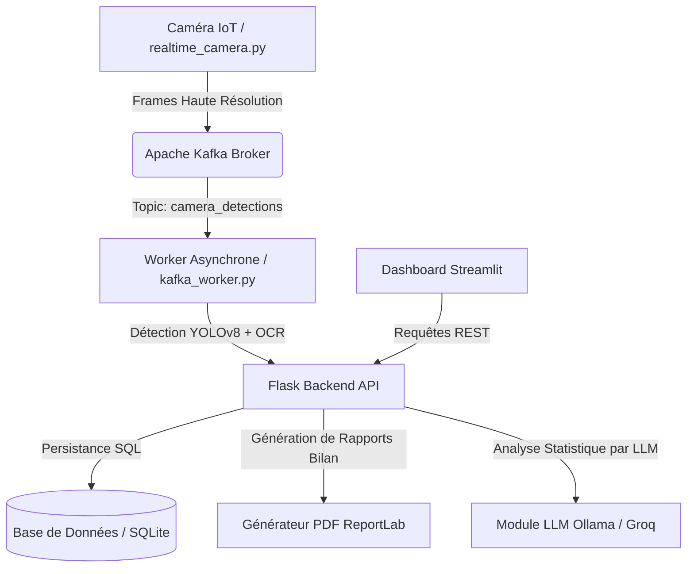

# Port Logistics AI — Solution Intelligente de Vision par Ordinateur et d'Optimisation pour Marsa Maroc

> **Projet de Fin d'Études (PFE)**
> Plateforme intégrée de détection automatique de conteneurs (IA YOLOv8 & OCR double orientation), de streaming temps réel (Kafka), d'optimisation de placement de parc (EDD) et d'aide à la décision 3D (Three.js).

---

## 📋 Table des Matières
- [🌟 Présentation Générale](#-présentation-générale)
- [🏗️ Architecture du Système](#️-architecture-du-système)
- [⚡ Technologies Clés](#-technologies-clés)
- [🚀 Installation et Démarrage](#-installation-et-démarrage)
- [📷 Simulation Caméra IoT & Kafka](#-simulation-caméra-iot--kafka)
- [📦 Structure Détaillée du Code](#-structure-détaillée-du-code)
- [📊 Fonctionnalités Métier](#-fonctionnalités-métier)

---

## 🌟 Présentation Générale

Dans le secteur de la logistique portuaire, la saisie et le suivi manuel des conteneurs engendrent des retards opérationnels aux portiques STS (*Ship-to-Shore*) et des erreurs d'allocation dans les parcs de stockage. 

**Port Logistics AI** est une solution moderne de bout en bout conçue pour **Marsa Maroc** afin d'automatiser ces flux :
1. **Lecture Automatique (OCR)** : Capture et numérisation des numéros d'identification des conteneurs (horizontaux et verticaux) avec une robustesse maximale grâce au prétraitement d'image (rotation, recadrage ciblé).
2. **Streaming & Asynchronisme** : Transmission en temps réel des captures de caméras IoT vers un courtier de messages **Apache Kafka** géré en arrière-plan par un worker IA dédié.
3. **Aide au Placement (Optimisation)** : Recommandation d'emplacement de stockage optimisé calculé via une heuristique d'échéance (EDD - *Earliest Due Date*) pour limiter les doubles manipulations de grues de parc (RTG).
4. **Visualisation Interactive** : Tableau de bord décisionnel interactif sous Streamlit affichant les indicateurs clés (KPI) et une vue 3D temps réel du parc de conteneurs avec Three.js.

---

## 🏗️ Architecture du Système

Le projet adopte une architecture microservices modulaire, garantissant une séparation claire entre le traitement d'image, le stockage de données, l'orchestration asynchrone et l'affichage utilisateur.



---

## ⚡ Technologies Clés

| Composant | Technologie | Description / Rôle |
| :--- | :--- | :--- |
| **Vision par Ordinateur** | **YOLOv8** & **EasyOCR** | Détection d'objets (conteneurs) et extraction de texte ISO 6346 (supportant les codes verticaux complexes). |
| **Streaming de Données** | **Apache Kafka** | Ingestion asynchrone à haute fréquence des détections caméras. |
| **Backend & API** | **Flask (Python)** | Expose les endpoints REST pour la détection, la gestion du yard et les statistiques. |
| **Base de Données** | **SQLAlchemy / SQLite** | Modélisation objet-relationnel (ORM) et persistance des événements portuaires. |
| **Frontend** | **Streamlit** | Interface utilisateur dynamique avec rapports interactifs Plotly. |
| **Moteur 3D** | **Three.js** | Rendu tridimensionnel interactif du parc de conteneurs intégré au Dashboard. |
| **Génération de Rapports** | **ReportLab & LLM** | Compte-rendus PDF automatiques enrichis par résumés de situation générés par IA. |

---

## 🚀 Installation et Démarrage

### 1. Prérequis
- Python 3.11+
- Docker & Docker Compose (pour Kafka et le déploiement multi-conteneur)
- Caméra Web (facultatif, pour la simulation IoT caméra)

### 2. Installation Locale

1. **Cloner le projet** et se placer à la racine :
   ```bash
   cd container_ai_project
   ```

2. **Créer et activer l'environnement virtuel** :
   ```powershell
   # Sous Windows
   python -m venv mersa_pfe
   .\mersa_pfe\Scripts\activate
   ```

3. **Installer les dépendances** :
   ```bash
   pip install -r requirements.txt
   ```

4. **Configurer l'environnement** :
   Copiez le fichier `.env.example` (ou modifiez le `.env` existant) pour configurer vos clés d'API (Ollama/Groq), l'URL de votre base de données et l'adresse du serveur Kafka.

### 3. Lancement des Services

Pour démarrer l'ensemble des services en local :

#### A. Lancer l'API Backend
```bash
python backend/app.py
```
> [!NOTE]
> L'API Flask démarre sur `http://localhost:5000`. Vous pouvez tester sa santé sur `http://localhost:5000/health`.

#### B. Démarrer le Dashboard Client
```bash
streamlit run dashboard/dashboard.py
```
> Le Dashboard s'ouvre automatiquement à l'adresse `http://localhost:8501`.

#### C. Lancer le Service de Message (Docker Compose)
Pour démarrer Kafka et Zookeeper pour le streaming temps réel :
```bash
docker-compose -f docker/docker-compose.yml up -d
```

#### D. Lancer le Worker Kafka
Le worker consomme les messages de la caméra de surveillance en arrière-plan et effectue l'OCR :
```bash
python backend/services/kafka_worker.py
```

---

## 📷 Simulation Caméra IoT & Kafka

Le script `realtime_camera.py` à la racine permet de simuler une caméra portuaire connectée. Il capture le flux vidéo (par défaut l'index `0` de votre webcam), détecte la présence d'un conteneur à l'aide d'une version locale de YOLOv8, attend 2 secondes de mise au point pour stabiliser l'image, puis envoie la frame encodée en Base64 dans le topic Kafka `camera_detections`.

**Pour lancer la simulation de caméra :**
```bash
python realtime_camera.py
```

---

## 📦 Structure Détaillée du Code

Voici l'organisation simplifiée et épurée des sources du projet :

* **`backend/`** : Logique serveur REST Flask
  * **`routes/`** : Contrôleurs REST (`yard.py` pour le positionnement 3D, `detection.py` pour l'OCR, `reports.py` pour les PDFs).
  * **`services/`** :
    * `ocr_reader.py` : Algorithme intelligent d'OCR avec filtres de rotation pour les codes verticaux.
    * `yard_optimizer.py` : Logique d'allocation de blocs (A, B, C, D, S1, S2) selon l'algorithme EDD.
    * `report_gen.py` : Moteur de rendu PDF pour les rapports portuaires hebdomadaires.
* **`dashboard/`** : Interface graphique Streamlit et intégration de la scène 3D Three.js.
* **`model/`** : Poids YOLOv8 et code d'entraînement personnalisé (`train_yolo.py`).
* **`llm/`** : Service de résumé automatique textuel à destination de la direction.
* **`_test_all.py`** : Script d'auto-validation globale des composants techniques.

---

## 📊 Fonctionnalités Métier

### 🧠 OCR Intelligent Double-Orientation
L'OCR du projet extrait les numéros de conteneurs au format standard ISO (ex: `MSCU1234567`). Si le numéro est disposé verticalement (cas fréquent sur les portes ou flancs de conteneurs), le module `ocr_reader.py` isole la zone de détection, effectue des analyses d'orientation et de rotation à 90°/270°, puis rassemble les caractères verticalement avant de valider la structure par une expression régulière.

### 📐 Optimiseur de Yard (Gestion de Parc)
L'algorithme de rangement garantit :
- Les conteneurs de **20 pieds** sont dirigés vers les blocs `A`, `B` ou `S1`.
- Les conteneurs de **40 pieds** vers les blocs `C`, `D` ou `S2`.
- Le choix de la pile exacte repose sur une stratégie **Anti-Shuffling** : on évite de placer un conteneur qui part bientôt sous un conteneur qui part plus tard.

---
*Projet développé dans le cadre d'un stage de fin d'études en collaboration avec les équipes techniques de Marsa Maroc.*
